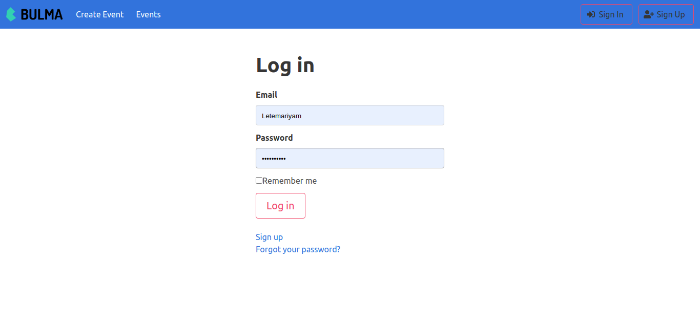

# Private events

This is part of the Association in [The Odin Project](https://www.theodinproject.com/courses/ruby-on-rails/lessons/authentication)’s Ruby on Rails Curriculum.

## Required installations
This app requires the following packages to be installed on you system:

* Ruby 2.7.0
* Rails 6.0.3.2

## Setup configurations

To get this app ready to run, follow this steps:

* clone this repo

        pc:~$ git clone git@github.com:keddo/private-events.git

* install require gems

        pc:~$ bundle install
* in case you need to run

        pc:~$ yarn install --check-files
* Run database migration

        pc:~$ rails db:migrate

* Start the rails' server to test

        pc:~$ rails server or rails s

## Author

👤 **Kedir Abdurahman**
- Github: [@keddo](https://github.com/keddo)
- Twitter: [@kedirman](https://twitter.com/kedirman)
- Linkedin: [Kedir Abdurahman](https://linkedin.com/in/kedirabdurahman/) 

👤 **Felipe Dacal Fragoso**

- Github: [@fdfragoso](https://github.com/fdfragoso)
- Twitter: [@fdfragoso](https://twitter.com/fdfragoso)
- Linkedin: [@fdfragoso](https://www.linkedin.com/in/fdfragoso/)

## Show your support

Give a ⭐️ if you like this project!

## Acknowledgments

- Project inspired by Microverse Program
- Project originally taken from the odin project